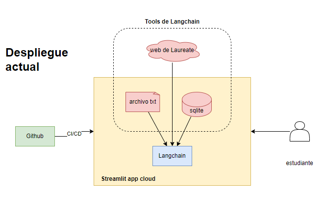
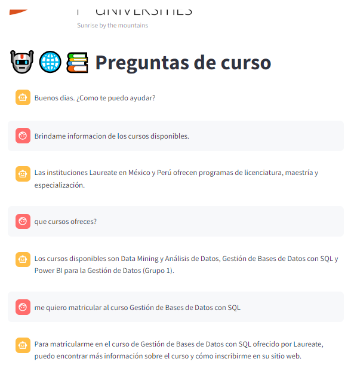
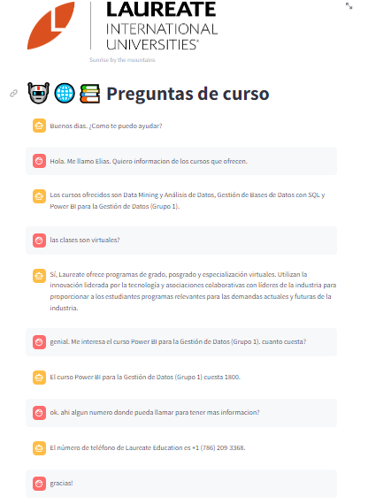
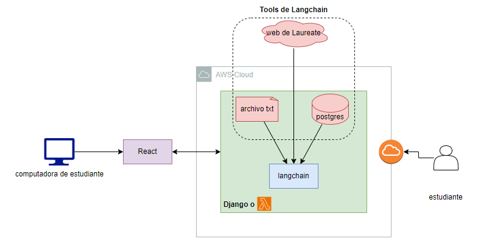
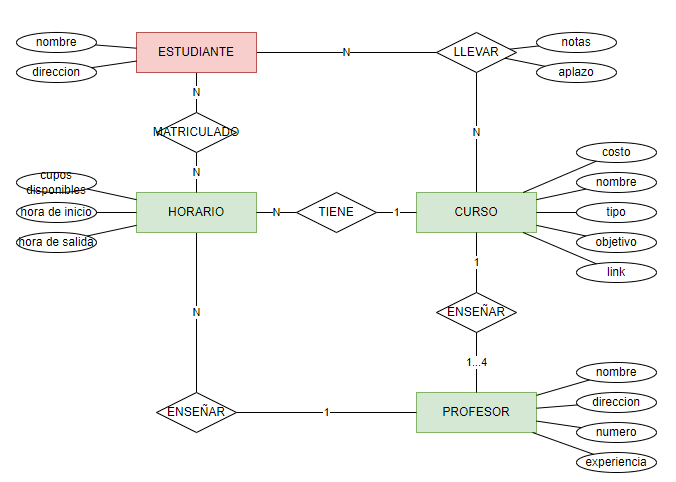

# Trabajo
Se solicita hacer un chatbot que pueda recomentar los cursos que ofrece la entidad educativa Laurente. 
# Despliegue local de la aplicacion
Crear entorno virtual y activarlo:
```bash
cd /path/of/repository/streamlit_agent
python3 -m venv venv
source ./venv/bin/activate
```
Instalar dependencias:
```bash
cd /path/of/repository
pip3 install -r requirements.txt
```
Correr aplicativo localmente:
```bash
cd /path/of/repository
streamlit run ./streamlit_agent/courses.py 
```

# Arquitectura enviada
El aplicativo esta desplegado bajo la siguiente arqiutectura:


Desde el repositorio ubicado en Github se hace el despliegue continuo (CI/CD) a la plataforma Streamlit app cloud. 

Los tools usados son tres:
- web: de aqui se extrae informacion directamente de la web de la universidad
- sqlite: Se extrae la informacion de los cursos, descripcion, link etc.
- archivo txt: De aqui se extrae la base de conocimiento escrita por personas que anteriormente ocuparon el cargo de atencion al cliente. 

Se puede acceder al aplicativo siguiendo el siguiente [link](https://aiapp-agent-pjkzwn2igc6m9hyu4s8eds.streamlit.app/).
# Casos de uso

Caso de uso 1:



Caso de uso 2:



# Mejoras propuestas

- __backend__: Usar Django como backend ya que este framework se programa usando Python, lo que facilitaria la integracion con LangChain. Tambien se podria usar Lambda para reducir costos.
- __DB__: Se recomienda Postgres por se open source, escalable y con mucha documentacion. Se almacenara la informacion de los cursos, estudiantes, profesores etc.
- __frontend web__: El frontend se puede hacer con React si es que lo que se busca es un rapido desarrollo.
- __Cloud service provider__: Se podria desplegar el desarrollo en AWS por ser un provedor reconocido que da servicios de ML e IA. 



Tambien se propone que brinde mas informacion (base de conocimiento). Esta informacion puede almacenarse en una base de datos para las consultas necesarias. En caso sea una base de datos en produccion, se podria restringir el acceso de la IA mediante alguna politica para evitar filtracion de datos. 

De no existir propongo el siguiente diseño sencillo. Se muestra el diagrama ERD del dicho diseño. En verde las tablas a la cual la IA puede hacerle query sin problemas. En rojo se ve la tabla a la cual no deberian tener acceso los estudiantes.


# fuente
Documentacion
- acerca de chroma, [link](https://python.langchain.com/docs/integrations/vectorstores/chroma)
- aligment en LLM, [link](https://www.linkedin.com/pulse/importance-alignment-llms-nilesh-barla/)
- integrar con wsp, [link](https://python.langchain.com/docs/integrations/chat_loaders)
- frontend para langchain con streamlit, [link](https://python.langchain.com/docs/integrations/callbacks/streamlit), [link](https://streamlit.io/generative-ai)
- como usar SQLite con vscode, [link](https://www.youtube.com/watch?v=QDP_PTg6BcQ)
- agent + vector store, [link](https://python.langchain.com/docs/modules/agents/how_to/agent_vectorstore#use-the-agent-solely-as-a-router)
- Creating a SQLite database with Python code, [link](https://www.sqlitetutorial.net/sqlite-python/creating-database/)

Solucion a problemas
- como solucionar el problema que se presenta al usar Chroma y desplegar el aplicativo a streamlit app, [link](https://discuss.streamlit.io/t/issues-with-chroma-and-sqlite/47950/5), [link](https://stackoverflow.com/questions/76958817/streamlit-your-system-has-an-unsupported-version-of-sqlite3-chroma-requires-sq/76959262#76959262)
- resolver el problema con WebBaseLoader,
[link](https://github.com/langchain-ai/langchain/issues/11095)


Las dependencias se tomaron del archivo _pyproject.toml_.

